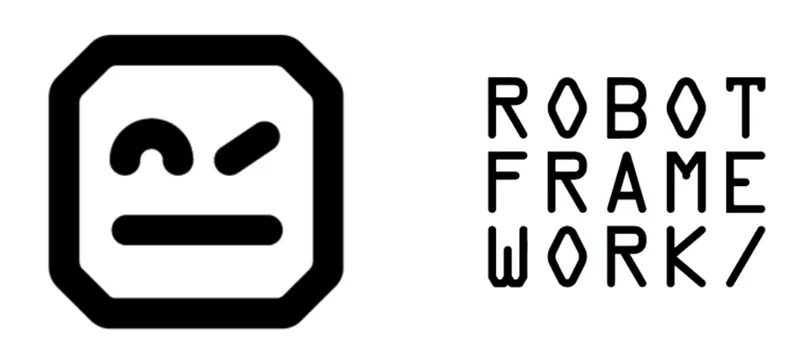

  

# Viver de Teste - Temporada 2 

Repository with e2e tests to automate an online World Cup trade sticker website.  
This is part of [QAcademy](https://www.qacademy.io/) series Viver de Teste.

### 📚 What I learn 
- How to create end-to-end tests using Robot Framework.
- How to use Robot Framework, a keyword-driven test framework.
- How to use Page Objects pattern on Robot

### 💻 Stack 
- Robot Framework
- Browser Library